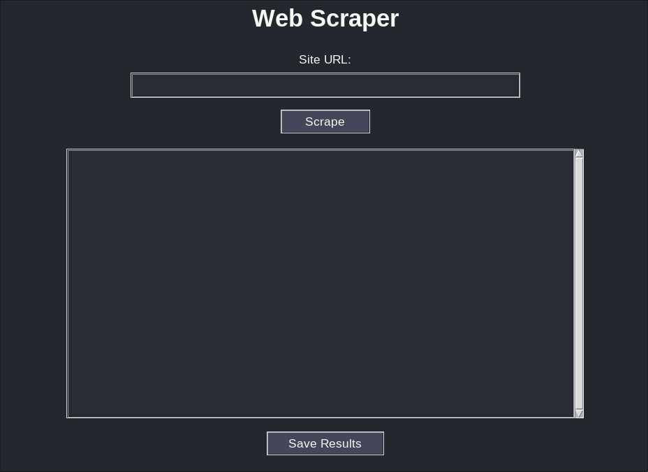
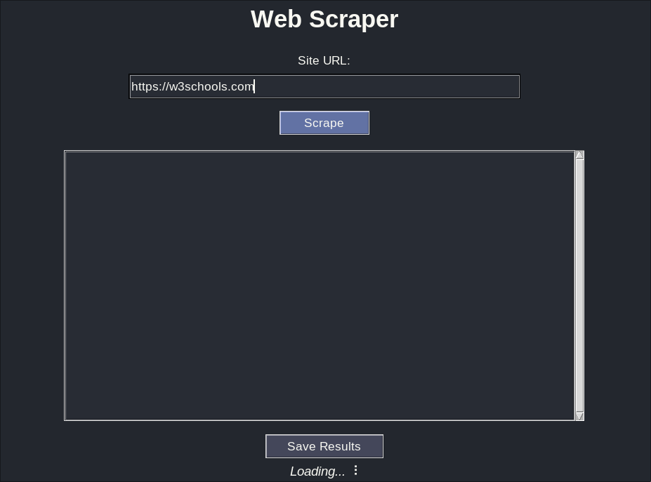
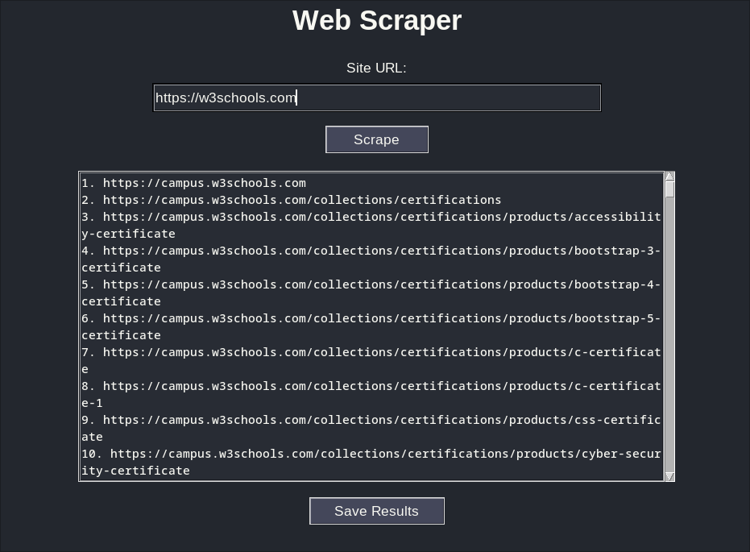

# WebScraper

WebScraper is a Python project for extracting all links from a given website. It features both a command-line interface (CLI) and a modern, dark-themed graphical user interface (GUI) built with Tkinter.

## Features
- Extracts all links from a specified website
- Saves results to a timestamped text file
- Dark-themed, user-friendly GUI (Tkinter)
- CLI usage for quick scraping
- Error handling for invalid URLs and network issues

## Requirements
- Python 3.7+
- See `requirements.txt` for dependencies:
  - requests
  - beautifulsoup4
  - lxml
  - pyfiglet

## Installation
1. Clone the repository:
   ```bash
   git clone <repo-url>
   cd WebScraper
   ```
2. Install dependencies:
   ```bash
   pip install -r requirements.txt
   ```

## Usage

### Command-Line Interface (CLI)
Run the scraper from the terminal:
```bash
python main.py <site_url>
```
- Example:
  ```bash
  python main.py example.com
  ```
- The results will be printed to the console and saved in the `Results/` folder.

### Graphical User Interface (GUI)
1. Start the GUI:
   ```bash
   python Modules/gui.py
   ```
2. Enter the website URL (e.g., https://example.com) in the input field.
3. Click the "Scrape" button or press Enter to start scraping.
4. All found links will be displayed in the results area.
5. Click "Save Results" to export the links to a file in the `Results/` folder.

## ScreenShots


<p align="center"><i>This is the initial look of the application when you first open it.</i></p>


<p align="center"><i>After entering a URL and clicking 'Scrape', the application scans the website for links.</i></p>


<p align="center"><i>All found links are displayed in the results area, ready to be saved.</i></p>


## Folder Structure
```
WebScraper/
├── main.py              # CLI entry point
├── requirements.txt     # Python dependencies
├── README.md            # Project documentation
├── Results/             # Scraped results are saved here
├── Modules/
│   ├── scraper.py       # Scraping logic
│   ├── greeting.py      # Welcome message logic
│   └── gui.py           # Tkinter GUI
```
